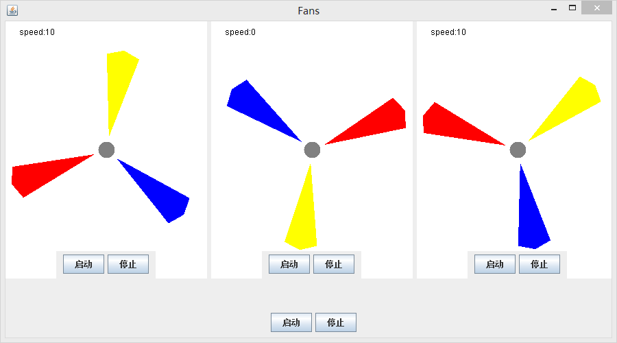
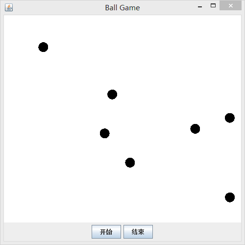
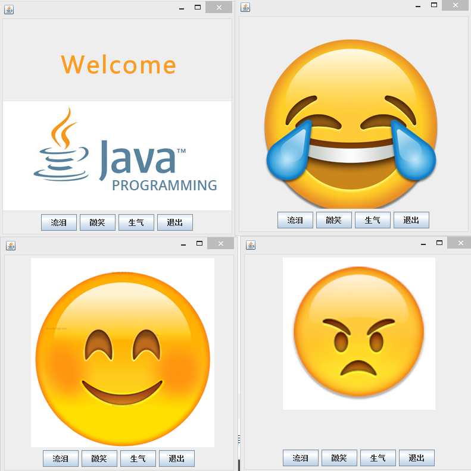

# Three Java Assignments
----
> Author：`Lei Yang`

> E-mail：`ylxx@live.com`

> Data：`2016-12-02`

> Description：A part of  ***Java Programming Design*** 's assignments at the first semester of my junior year

## 1. FanControl.java

### Requirement
编写程序，显示3个风扇，用控制按钮开动和停止风扇。可以同时开动和停止3个风扇，也可以分别开动和停止每一个风扇。

### Description

转动速度从0开始 加速度由最大到0 的缓慢变化 以模拟真实物理效果

### FanControl Interface :

## 2. BallGame.java

### Requirement
编写程序，该程序通过一个发射按钮可以发射一个弹球，该球遇到边界时会自动弹回，在移动固定次数后，该球停止运动。要求每次点击发射按钮都会发射一个弹球，如果点击多次，则多个弹球同时运动。该程序通过另一个结束可以结束程序的运行。

### Description
use Multi thread

增加了速度开方递减的效果

这样更接近于物理世界

### BallGame Interface :

## 3. Emoji.java

### Requirement
编写程序，显示不同的表情。在窗口上至少包括4个按钮，分别控制显示不同的表情和退出程序。

### Description
截图布局

|左|右|
|---||---|
| 欢迎界面 | 流泪|
|微笑        | 生气|

### Emoji Interface :

